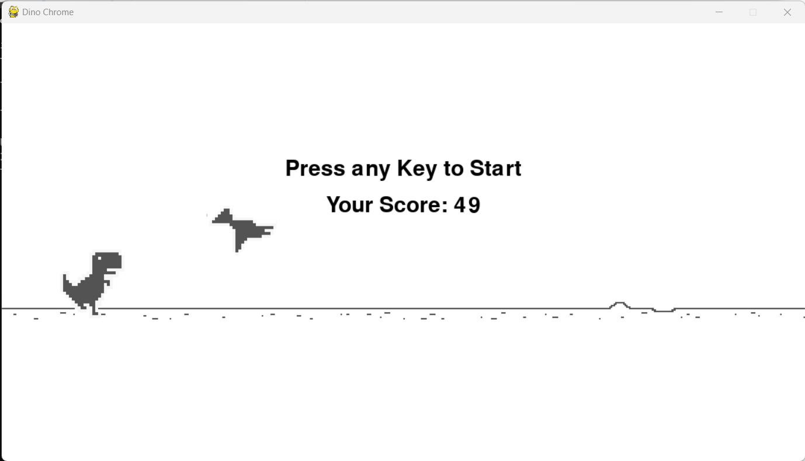
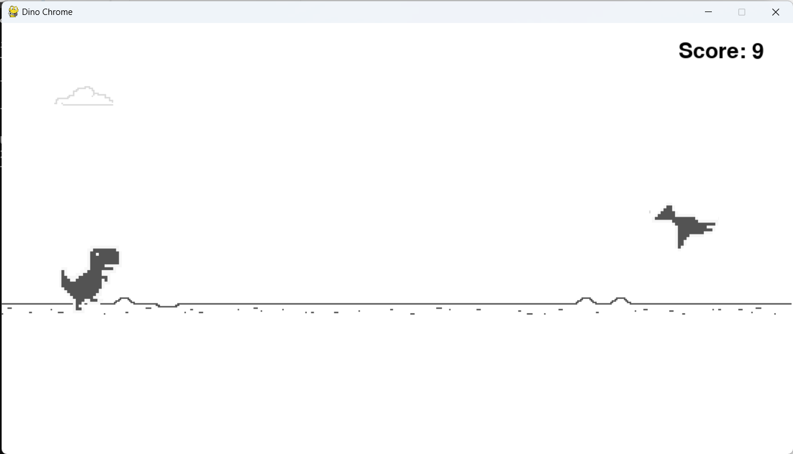
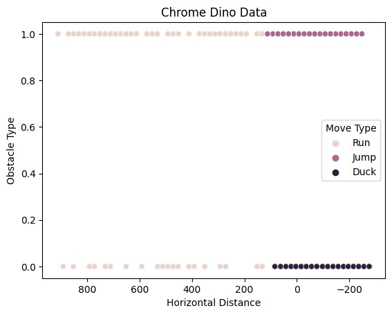
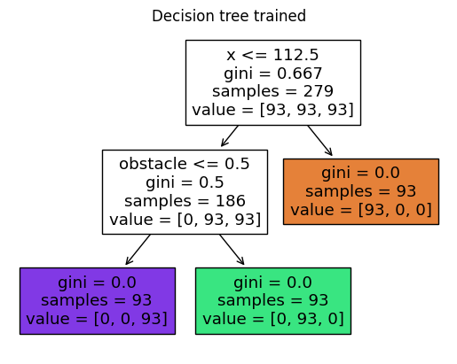
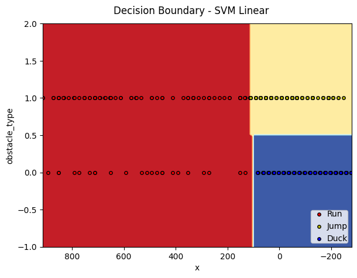
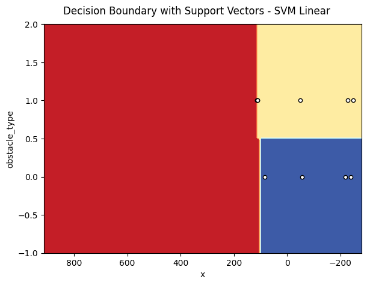

<h1>SOLVING CHROME DINOSAUR WITH SUPERVISED LEARNING</h1>

## Implementing the Game

The game was implemented using the pygame library for the interface and uses artwork that faithfully replicates the original game. The application consists of two screens:

<p align="center"> 
    
</p>
  
The home screen features a dinosaur animated by an invincible machine learning model, providing a demonstration of how to play the game. A prompt instructs the user to press a key to start a game, which resumes from the current position of the dinosaur and obstacles. If the user has played before, the last score is displayed.

<p align="center"> 
    
</p>

At the beginning of the game, obstacles like cacti and birds appear, prompting the player to move to avoid collisions. The user can make two moves: jumping or crouching. Colliding with an obstacle returns the user to the home screen, where they can start a new game and view their final score.

## Intelligent Agent Strategies

Initially, gameplay data was collected when the dinosaur successfully navigated an obstacle (`dino_game\data\dino.csv`). Initial models were trained using this data and played games to generate new data (`dino_game\data_new_dino.csv`), this approach was necessary to address erratic and inconsistent gameplay behavior exhibited by a human player.

The collected and balanced data revealed certain patterns:

<p align="center"> 
    
</p>

Analysis of the data shows that:

- A significant horizontal distance results in the agent continuing to run
- Approach to obstacle type 0 (bird) prompts crouching
- Approach to obstacle type 1 (cactus) prompts jumping

Since the data is limited to screen coordinates and booleans, it is presented in a well-defined format, with the x-axis being mirrored to accurately represent the game. As testing was conducted in the game environment itself, the data was not split into training and testing sets.

To tackle this challenge, a supervised learning approach was employed, specifically utilizing decision tree and support vector machine techniques. When training a decision tree, it is important to consider that it segments the data at each node, and these segments are parallel to the variable axes:

<p align="center"> 
    
</p>

Interpreting the decision tree results, it is evident that:

- Initially, the minimum horizontal distance is checked, and the dinosaur continues running if not met
- Once the minimum distance is met, the obstacle type is checked to determine the necessary movement

A simple and highly interpretable tree confirms this interpretation:

<p align="center"> 
    
</p>

Training the SVM with a linear kernel yielded similar results to the decision tree, with hyperplanes adjusted in a manner parallel to the axes:

<p align="center"> 
    
</p>

It's noteworthy that only points reflecting jumping and crouching movements were used as support vectors for decision boundary adjustment:

<p align="center"> 
    
</p>

In the end, two invincible models were obtained, and the game's home screen allows users to inspect these models before starting a game (agents are randomly selected when the game runs).

## Dino Chrome Pack Organization
```
dino_game/                    Top-level package
      __init__.py
      constants.py
      base.py
      cloud.py
      enemies.py
      obstacles.py
      dinosaur.py
      chrome_dino.py          It brings together the functionalities of the modules to implement the game
      media/                  Folder with the files used in the game's interface
              ...
      models/                 File with the trained ML models
              dtc.pkl
              svm_linear.pkl
      data/
              dino.csv        Data collected from game matches by a human player
              new_dino.csv    Data collected in game matches by early ML models
```
## Running the Game

Using Windows OS and make sure you have [Python 3](https://www.python.org/) installed.

Clone the project:

```bash
  git clone https://github.com/filipemedeiross/solving_chrome_dinosaur_with_supervised_learning.git
```

Access the project directory:

```bash
  cd solving_chrome_dinosaur_with_supervised_learning
```

Creating a virtual environment (for the example we use the location directory parameter as `.venv`):

```bash
  python -m venv .venv
```

Activating the virtual environment:

```bash
  .venv\Scripts\activate
```

Install all required packages specified in requirements.txt:

```bash
  pip install -r requirements.txt
```

Use the following command to run the game:

```bash
  python main.py
```
## References

Wilmott, Paul. Machine Learning - An Applied Mathematics Introduction. Panda Ghana Publishing, 2019.

Images used: <https://opengameart.org/>

Pygame: <https://www.pygame.org/docs/>

Sklearn: <https://scikit-learn.org/stable/modules/classes.html>
